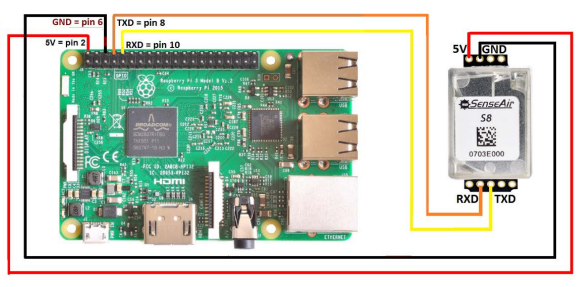

# Senseair S8 for Python

Python module for reading CO2 concentration from a Senseair S8 sensor connected to a Raspberry Pi

## Connecting the Senseair S8 to your Raspberry Pi

Hook up the Senseair S8 to your Raspberry Pi using the following schematic:



Image source: <http://co2meters.com/Documentation/AppNotes/AN168-S8-raspberry-pi-uart.pdf>

## Module installation

```bash
pip install senseair-s8
```

## Usage

As a module:

```python
from senseair_s8 import SenseairS8, SenseairS8Exception

sensor = SenseairS8()
try:
    co2 = sensor.co2()
    print(f"CO2 concentration: {co2} ppm")
except SenseairS8Exception as e:
    print(f"Failed to read CO2: {e}")
```

From the command line (this logs the CO2 concentration at ~1 second intervals):

```bash
python -m senseair_s8
```

## Troubleshooting

- This module expects the sensor to be connected to port `/dev/ttyS0`. It was only tested using that port, but you can override this setting when initializing the sensor:

```python
sensor = SenseairS8(port='/dev/ttyS0')
```

- Out of the box, `/dev/ttyS0` is disabled on a Raspberry Pi, resulting in a `permission denied` error. You can enable it by:
    1. Run `sudo raspi-config`
    2. Select Interfacing options
    3. Select P6 Serial
    4. Select No for login console
    5. Select Yes for serial port hardware
    6. OK, Finish, Reboot - Yes
